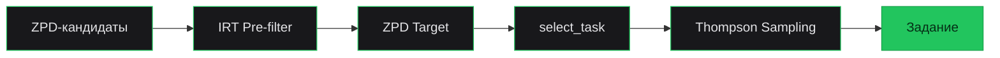
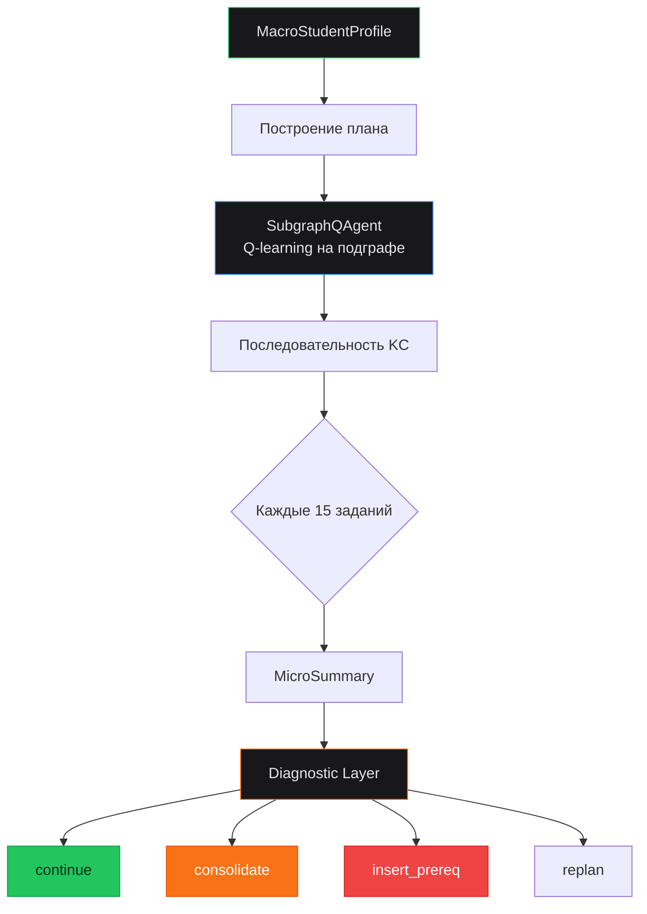
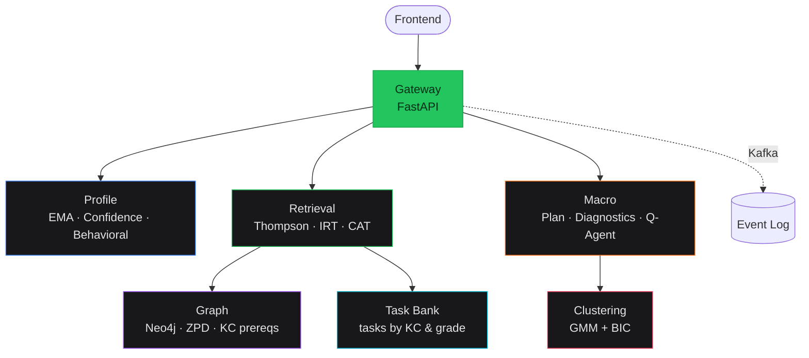

<div align="center">


### Адаптивная рекомендательная система для персонализированного обучения математике

[](https://github.com/Kew1710/learnity-recsys/actions)


[](https://learnity-recsys.streamlit.app)

<br/>

**142** Knowledge Components · **253** связи в графе · **7** микросервисов · **5–11** класс

</div>

---

## Демо

<!-- Замени ссылку на своё видео (YouTube / Google Drive / Loom) -->
<!-- Вариант 1: YouTube -->
<!-- [](https://www.youtube.com/watch?v=VIDEO_ID) -->

<!-- Вариант 2: mp4 прямо в README (GitHub поддерживает) -->
<!-- https://github.com/user-attachments/assets/xxxxx.mp4 -->

> **TODO:** вставь сюда ссылку на видео с демонстрацией app

[](https://learnity-recsys.streamlit.app)

Интерактивное демо работает без установки — все вычисления in-memory.

**4 вкладки:**
| Вкладка | Что показывает |
|---------|---------------|
| **Полная симуляция** | CAT-диагностика → кластеризация → план → пошаговое обучение с графом знаний |
| **Micro-уровень** | Пайплайн подбора задания: IRT → ZPD → select_task, два режима (полный путь / пошагово) |
| **Macro-уровень** | MacroStudentProfile → план обучения → граф с объяснением каждого шага |
| **Mastery & Confidence** | EMA smooth_update в реальном времени, confidence от числа попыток |

---

## Проблема

Традиционное обучение — one-size-fits-all. Все получают одинаковые задания, независимо от уровня. Результат: фрустрация у слабых, скука у сильных, неэффективное обучение у всех.

## Решение

ML-система, которая в реальном времени подбирает задание для каждого ученика, опираясь на текущий уровень знаний, зону ближайшего развития и контекстный бандит.

---

## Как это работает

### Граф знаний (Knowledge Components)

```
142 KC-ноды · 253 ребра пререквизитов · 4 предмета
арифметика (15) → алгебра (74) → геометрия (45) → статистика (8)
```

Каждая тема (KC) связана пререквизитами: нельзя изучать квадратные уравнения, не освоив линейные. Граф хранится в Neo4j и определяет порядок обучения.

### Micro-уровень: подбор задания

Отвечает за выбор **конкретного задания** прямо сейчас.



| Шаг | Что делает | Ключевой параметр |
|-----|-----------|-------------------|
| **IRT Pre-filter** | Убирает задания с P(correct) вне допустимого диапазона | build: [0.20, 0.90] |
| **ZPD Target** | Целевая сложность относительно mastery | build +0.10, test +0.30 |
| **select_task** | 80% exploitation / 20% stretch | ближайшее к target |
| **Thompson Sampling** | Байесовский бандит, 13-мерный контекст | cluster_task_stats → x[7] |

**Три режима**, переключаются автоматически:

| Режим | Когда | Сложность | Exploration |
|-------|-------|-----------|-------------|
| **build** | по умолчанию | чуть выше уровня | 20% cluster, 5% ε |
| **consolidate** | точность < 45% | чуть ниже уровня | 10% cluster, 10% ε |
| **test** | mastery близко к порогу | заметно выше | 0% |

### Macro-уровень: управление планом

Отвечает за **стратегию** — какие темы изучать, в каком порядке, когда переключать режим.



**SubgraphQAgent** — табличный Q-learning агент, обученный на BKT-симуляторе. Состояние — дискретизированный mastery-профиль подграфа (5 бинов × N тем + profile features). Действие — выбор следующей KC. Учится строить оптимальный маршрут к target_mastery.

**Diagnostic Layer** — определяет **причину** проблемы, а не просто реагирует на симптомы:

| Диагноз | Когда срабатывает | Реакция |
|---------|-------------------|---------|
| `prereq_gap` | слабый пререквизит | вставить KC в план |
| `content_gap` | мало заданий нужной сложности | teacher_alert |
| `uncertain_estimate` | мало данных | продолжить наблюдение |
| `regression` | забывание после освоения | consolidate режим |

### Cold Start: диагностический CAT

```
Новый ученик → 5-8 адаптивных заданий → калибровка mastery
              (максимум информации Фишера + BFS-распространение)
```

Выбирает KC с минимумом наблюдений, задания где P(correct) ≈ 0.5. Результат транзитивно распространяется на пререквизиты и зависимые через BFS с затуханием.

### Кластеризация учеников

- **GMM + BIC** — автоматический подбор числа кластеров
- **Confidence-weighted assignment** — расстояние до центроида взвешено уверенностью оценки
- **Transfer** — новый ученик получает Thompson Sampling prior из своего кластера
- **Перекластеризация** каждые 15 заданий — ученик может сменить кластер

---

## Быстрый старт

### Онлайн

[](https://learnity-recsys.streamlit.app)

### Локально (без БД)

```bash
git clone https://github.com/Kew1710/learnity-recsys.git
cd learnity-recsys
pip install -r demo/requirements.txt
streamlit run demo/app.py
```

### Полный запуск (Docker)

```bash
docker-compose up -d          # PostgreSQL, Neo4j, Kafka
alembic upgrade head          # миграции

# сервисы
uvicorn services.gateway.main:app   --port 8000
uvicorn services.profile.main:app   --port 8001
uvicorn services.graph.main:app     --port 8002
uvicorn services.task_bank.main:app --port 8003
uvicorn services.retrieval.main:app --port 8004
uvicorn services.macro.main:app     --port 8005
```

### Тесты

```bash
python -m pytest services/ tools/tests/ -q    # 288 passed
```

---

## Архитектура



<details>
<summary><b>Структура проекта</b></summary>

```
learnity-recsys/
├── services/
│   ├── profile/           # EMA mastery, confidence, behavioral signals
│   ├── retrieval/          # Thompson Sampling, IRT, Diagnostic CAT
│   ├── macro/              # Plan lifecycle, SubgraphQAgent, estimators
│   ├── graph/              # KC graph (142 nodes, 253 edges), ZPD
│   ├── clustering/         # GMM + BIC, confidence-weighted assignment
│   ├── gateway/            # API gateway, Kafka routing, reward
│   ├── task_bank/          # Task storage and retrieval
│   └── e2e/               # Cross-service integration tests
├── shared/                 # Config, DB, schemas
├── migrations/             # Alembic (23 versions)
├── demo/app.py             # Streamlit interactive demo
├── tools/                  # offline_eval, simulation, ab_eval
└── docs/                   # ML contract, architecture, audit
```

</details>

---

## Стек

| | Технология | Зачем |
|---|-----------|-------|
| **ML** | Thompson Sampling, IRT, EMA/BKT, GMM+BIC, Q-learning | Mastery tracking, task selection, clustering, planning |
| **Backend** | Python, FastAPI, SQLAlchemy, Pydantic | Микросервисы с типизацией |
| **Data** | PostgreSQL, Neo4j, Apache Kafka | Состояние, граф знаний, события |
| **Infra** | Docker, GitHub Actions CI | Деплой и тесты |
| **Demo** | Streamlit, Plotly, Cytoscape.js | Интерактивная визуализация |

---

## Автор

**Александр Григорьев** · [alex.grig04.2@gmail.com](mailto:alex.grig04.2@gmail.com)

Junior ML Contest 2026, ИТМО · Номинация «AI в образовании»
