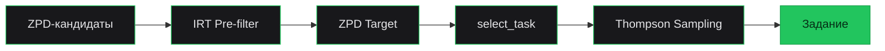
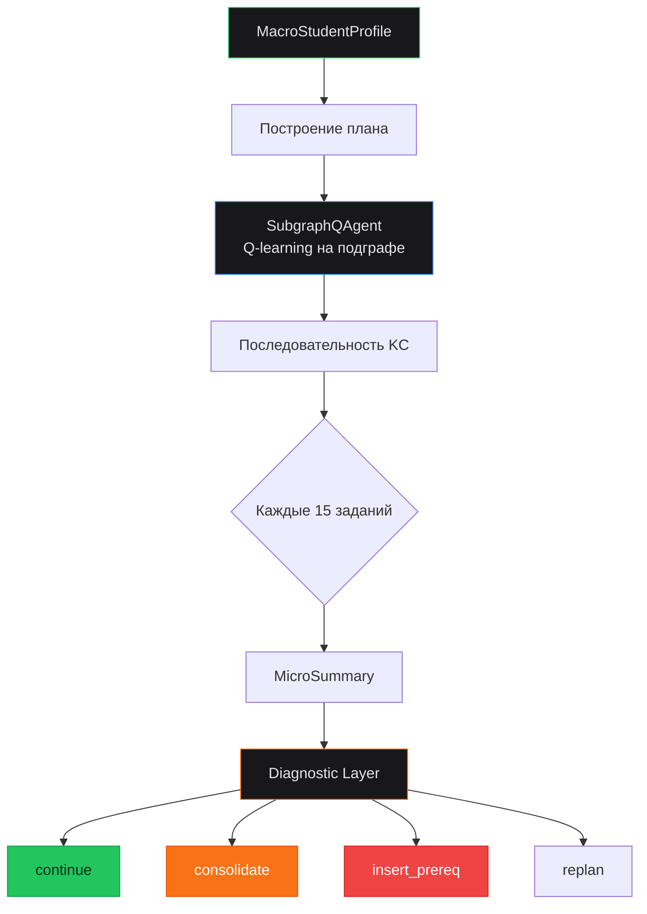
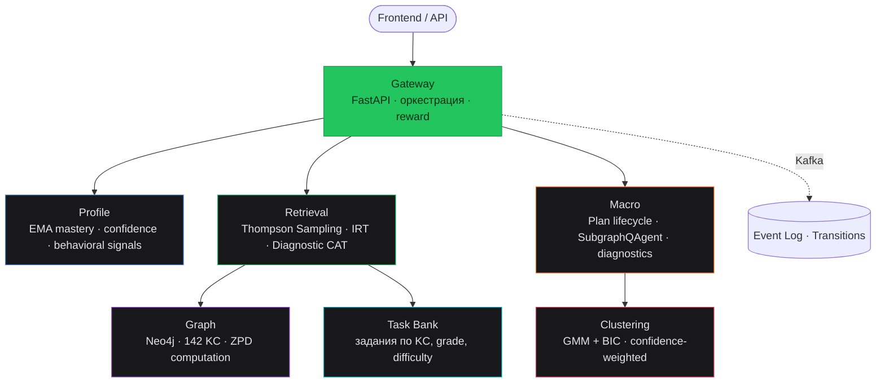

<div align="center">


### Адаптивная рекомендательная система для персонализированного обучения математике

[](https://github.com/Kew1710/learnity-recsys/actions)


[](https://learnity-recsys.streamlit.app)

</div>

---

## DEMO
<video src="https://github.com/user-attachments/assets/6f01d268-38e1-4681-9c47-596a4f5dcdc7" width="100%" controls></video>

> **ONLINE APP:** 

 Попробовать демоверсию ОНЛАЙН - []([https://learnity-recsys.streamlit.app](https://learnityrecsys-jmlc.streamlit.app/))

Интерактивное демо работает полностью в браузере — все вычисления in-memory, сервисы и БД не нужны. Четыре вкладки показывают разные уровни системы:

| Вкладка | Что внутри |
|---------|-----------|
| **Полная симуляция** | Весь цикл: CAT-диагностика нового ученика → кластеризация среди peers → построение учебного плана → пошаговое прохождение заданий с интерактивным графом знаний |
| **Micro-уровень** | Как система выбирает конкретное задание: IRT-фильтр, ZPD target, select_task. Два режима — сразу весь путь или пошагово по кнопке |
| **Macro-уровень** | Как строится учебный план: MacroStudentProfile (ползунки или пресет) → оценка бюджета и рисков → граф с объяснением каждого шага |
| **Mastery & Confidence** | Как обновляется оценка знаний после каждого ответа: EMA smooth_update, confidence, влияние streak и surprise |

---

## Проблема

Традиционное обучение математике — one-size-fits-all. Все ученики получают одинаковые задания, независимо от текущего уровня знаний.

Ученик, который не усвоил дроби, получает задания на уравнения — и ошибается не потому что не знает уравнения, а потому что не может сложить `1/3 + 1/4`. Сильный ученик решает десятки задач, которые уже давно освоил — и теряет мотивацию. Учитель физически не может отслеживать уровень каждого ученика по каждой теме.

## Решение

Learnity RecSys — ML-система, которая в реальном времени строит индивидуальный маршрут обучения и подбирает оптимальное задание для каждого ученика. Система работает на трёх уровнях:

- **Micro** — выбор конкретного задания прямо сейчас (IRT + Thompson Sampling)
- **Macro** — стратегия: какие темы изучать, в каком порядке, когда переключить режим (Q-learning + Diagnostics)
- **Meta** — кластеризация учеников для transfer learning и cold start (GMM + BIC)

---

## Граф знаний

Основа системы — методический граф по математике 5–11 класс. Каждая вершина — Knowledge Component (KC), ребро — пререквизит: «чтобы изучить B, нужно знать A».

```
142 KC-ноды · 253 ребра пререквизитов
4 предмета: арифметика (15) · алгебра (74) · геометрия (45) · статистика (8)
```

Граф определяет:
- **Порядок обучения** — система не предложит квадратные уравнения, пока ученик не освоил линейные
- **Зону ближайшего развития (ZPD)** — KC, которые ученик готов изучать сейчас (пререквизиты освоены, сама тема — ещё нет)
- **Маршрут до цели** — BFS от целевой темы по пререквизитам собирает все KC, которые нужно подтянуть

Граф хранится в Neo4j, но для демо загружается как Python-словарь из `services/graph/kc_data.py`.

---

## Micro-уровень: подбор задания

Micro-уровень отвечает за выбор **конкретного задания** в текущий момент. Полный pipeline:



**IRT Pre-filter** — отсекает задания, где вероятность правильного ответа P(correct) выходит за допустимый диапазон. Если все задания отсечены — fallback к 3 ближайшим. P(correct) вычисляется по модели Раша: `P = 1 / (1 + exp(-(θ - d)))`, где θ — logit от mastery ученика, d — IRT-сложность задания.

**ZPD Target** — вычисляет целевую сложность в зависимости от режима обучения. В build-режиме цель чуть выше текущего уровня (+0.10), в consolidate — чуть ниже (−0.10), в test — заметно выше (+0.30).

**select_task** — из отфильтрованных заданий с вероятностью 80% выбирает ближайшее к ZPD target (exploitation), с вероятностью 20% — stretch/exploration для обнаружения новых подходящих заданий.

**Thompson Sampling** — байесовский контекстный бандит. Контекстный вектор из 13 фич (mastery, confidence, streak, cluster stats и др.). Сэмплирует параметры из апостериорного распределения и выбирает задание с максимальным ожидаемым reward.

### Три режима обучения

Режим переключается автоматически на основе прогресса:

| Режим | Когда включается | IRT диапазон | Cluster explore | ε |
|-------|-----------------|--------------|----------------|---|
| **build** | По умолчанию — ученик изучает тему | [0.20, 0.90] | 20% | 5% |
| **consolidate** | Точность < 45% или фрустрация ≥ 2 | [0.40, 0.95] | 10% | 10% |
| **test** | Mastery ≥ порог − 0.10 | [0.15, 0.85] | 0% | 0% |

### Cold Start: диагностический CAT

Для нового ученика система проводит 5–8 адаптивных заданий. Каждое задание выбирается так, чтобы максимизировать информацию Фишера: `I(θ) = P(1−P)`, максимум при P = 0.5. Результат транзитивно распространяется на пререквизиты и зависимые KC через BFS с затуханием — это позволяет откалибровать весь профиль за несколько заданий.

---

## Macro-уровень: управление планом

Macro-уровень отвечает за **стратегию** — какие темы изучать, в каком порядке, когда переключить режим или вставить дополнительную тему.



### MacroStudentProfile

Агрегированный профиль ученика для стратегических решений. Включает: uncertainty_level, mastery_confidence_mean, learning_speed, frustration_risk, stall_risk_baseline, regression_risk_baseline, pacing_mode, budget_multiplier, prereq_strictness. Профиль влияет на бюджет заданий для каждого шага, строгость проверки пререквизитов и готовность к тестовому режиму.

### SubgraphQAgent

Табличный Q-learning агент, обученный на BKT-симуляторе. Состояние — дискретизированный mastery-профиль подграфа (5 бинов × N тем + profile features: confidence, weak_prereq_fraction, learning_speed, stall_risk, pacing). Действие — выбор следующей KC для изучения. Агент учится строить оптимальный маршрут к target_mastery, учитывая пререквизитные зависимости и индивидуальные особенности ученика.

### Diagnostic Layer

Каждые 15 заданий система собирает MicroSummary (velocity, avg_score, frustration_count) и запускает диагностику. Diagnostic Layer определяет **причину** проблемы:

| Диагноз | Сигнал | Реакция |
|---------|--------|---------|
| `prereq_gap` | Слабый пререквизит + низкий velocity | Вставить KC-пререквизит в план |
| `content_gap` | Мало заданий нужной сложности | Teacher alert |
| `uncertain_estimate` | Мало данных (< 3 попытки) | Продолжить наблюдение |
| `regression` | Mastery падает при высоком confidence | Переключить в consolidate |

---

## Кластеризация учеников

Система группирует учеников по mastery-вектору с помощью Gaussian Mixture Model. Число кластеров подбирается автоматически через BIC (Bayesian Information Criterion).

- **Confidence-weighted assignment** — при назначении нового ученика расстояние до центроида взвешивается уверенностью оценки: `weight = 0.25 + 0.75 * confidence`. Темы с низкой confidence меньше влияют на выбор кластера
- **cluster_task_stats** — средний reward по заданиям внутри кластера, попадает в контекстный вектор Thompson Sampling (x[7])
- **cluster_explore** — вероятность выбрать задание, которое хорошо зарекомендовало себя у похожих учеников (20% в build-режиме)
- **Перекластеризация** каждые 15 заданий — по мере накопления данных ученик может сменить кластер

---

## Mastery Tracking

Оценка знаний обновляется после каждого ответа через EMA (экспоненциальное скользящее среднее) с адаптивными бонусами:

```
new_mastery = mastery + lr * (score - mastery)
            + transit                          # бонус за попытку
            + streak_bonus * consecutive_correct  # бонус за серию правильных
            + surprise_bonus                    # бонус за неожиданный успех
```

**Confidence** — отдельная метрика, показывающая насколько система доверяет своей оценке mastery. Зависит от количества попыток, стабильности результатов и давности практики. Используется при кластеризации, диагностике и планировании.

**Decay** — mastery снижается со временем: `p * 0.5^(days / half_life)`. Полупериод зависит от предмета (арифметика — 90 дней, статистика — 30 дней). KC с mastery ниже порога возвращается в ZPD.

---

## Быстрый старт

### Онлайн-демо

Самый быстрый способ — открыть [Streamlit-демо](https://learnity-recsys.streamlit.app). Ничего устанавливать не нужно, всё работает в браузере. Демо позволяет:

- Прогнать полную симуляцию обучения для ученика выбранного типа и класса
- Пошагово увидеть как система подбирает каждое задание
- Настроить MacroStudentProfile и посмотреть как он влияет на план
- Поэкспериментировать с параметрами EMA mastery tracking

### Локальный запуск демо

```bash
git clone https://github.com/Kew1710/learnity-recsys.git
cd learnity-recsys
pip install -r demo/requirements.txt
streamlit run demo/app.py
```

Демо откроется на `http://localhost:8501`. Все вычисления in-memory — PostgreSQL, Neo4j и Kafka не нужны.

### Полный запуск системы (Docker)

Для запуска полной системы с базами данных и Kafka:

```bash
# 1. Поднять инфраструктуру
docker-compose up -d

# 2. Применить миграции
alembic upgrade head

# 3. Загрузить граф знаний в Neo4j
python -m services.graph.seed

# 4. Запустить сервисы (каждый в отдельном терминале или через make dev)
uvicorn services.gateway.main:app   --port 8000
uvicorn services.profile.main:app   --port 8001
uvicorn services.graph.main:app     --port 8002
uvicorn services.task_bank.main:app --port 8003
uvicorn services.retrieval.main:app --port 8004
uvicorn services.macro.main:app     --port 8005
```

### Консольный REPL

После запуска сервисов можно взаимодействовать с системой через консольный REPL:

```bash
python tools/play.py    # или: make play
```

REPL позволяет создать ученика, запросить рекомендацию, отправить ответ и посмотреть как меняется mastery — всё через API сервисов.

### Интеграция с внешним приложением

Система спроектирована как набор микросервисов за единым Gateway (порт 8000). Основные эндпоинты:

```
POST /register          — зарегистрировать ученика (grade, name)
POST /recommend          — получить рекомендованное задание
POST /answer             — отправить ответ (score 0..1)
GET  /mastery/{id}       — текущие mastery по всем KC
POST /plan/create        — создать учебный план к целевой теме
```

Gateway оркестрирует вызовы к Profile, Retrieval и Macro. События маршрутизируются через Kafka. Для интеграции достаточно HTTP-клиента к Gateway.

---

## Архитектура



<details>
<summary><b>Структура проекта</b></summary>

```
learnity-recsys/
├── services/
│   ├── profile/           # EMA mastery, confidence, behavioral signals
│   ├── retrieval/          # Thompson Sampling, IRT pre-filter, Diagnostic CAT
│   ├── macro/              # Plan lifecycle, SubgraphQAgent, estimators, diagnostics
│   ├── graph/              # KC graph (142 nodes, 253 edges), ZPD
│   ├── clustering/         # GMM + BIC, confidence-weighted assignment
│   ├── gateway/            # API gateway, Kafka routing, reward computation
│   ├── task_bank/          # Task storage and retrieval
│   └── e2e/               # Cross-service integration tests
├── shared/                 # Centralized config, DB connection, schemas
├── migrations/             # Alembic migrations
├── demo/app.py             # Streamlit interactive demo
├── tools/
│   ├── play.py             # Консольный REPL для ручного тестирования
│   ├── simulation.py       # Симуляция обучения (true vs visible mastery)
│   ├── offline_eval.py     # Offline evaluation: Brier, AUC, calibration
│   ├── ab_eval.py          # A/B тестирование: Thompson vs baseline
│   └── stats.py            # Аналитический дашборд
├── docker-compose.yml
├── Dockerfile
└── Makefile
```

</details>

---

## Стек

| | Технология | Роль в системе |
|---|-----------|---------------|
| **ML** | Thompson Sampling, IRT (Rasch), EMA/BKT, GMM+BIC, Q-learning | Mastery tracking, task selection, student clustering, plan optimization |
| **Backend** | Python 3.12, FastAPI, SQLAlchemy, Pydantic | Типизированные микросервисы с async I/O |
| **Data** | PostgreSQL, Neo4j, Apache Kafka | Состояние учеников, граф знаний, event streaming |
| **Infra** | Docker, Docker Compose, GitHub Actions | Контейнеризация, CI/CD |
| **Demo** | Streamlit, Plotly, Cytoscape.js | Интерактивная визуализация всех уровней системы |

---

## Автор

**Григорьев Алексей** · [alekesiproff@gmail.com@](mailto:alekseiproff@gmail.com)

Junior ML Contest 2026, ИТМО · Номинация «AI в образовании»
